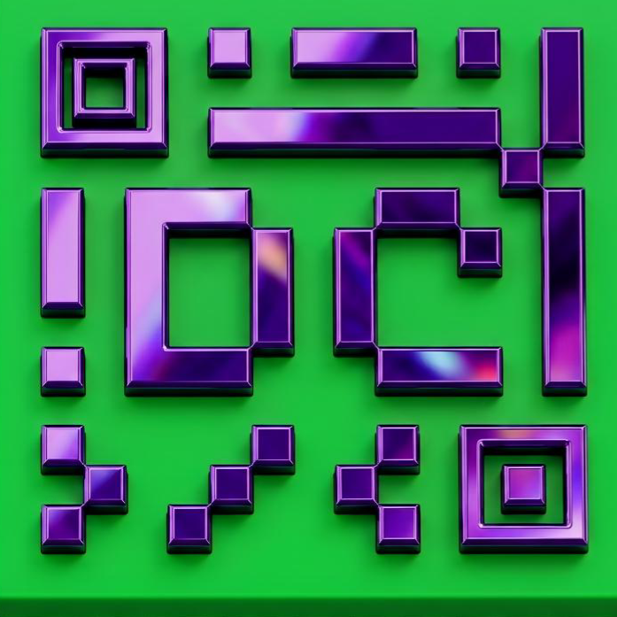

<h1 align="center">
  
  <br>
  🚀 DevClub - Área de Membros
</h1>

<p align="center">
  
</p>

<p align="center">
  <b>Uma recriação imersiva da área de membros da DevClub</b>
  <br>
  Plataforma de ensino responsiva com design futurista, navegação por scroll e foco em comunidade de devs
</p>

<p align="center">
  
  
  
  
  
</p>

## 📌 Sobre o Projeto

O DevClub é uma recriação da área de membros da DevClub feita do zero com HTML, CSS e JavaScript. O objetivo é simular uma plataforma real de ensino com design imersivo, navegação por scroll em 1 página só e organização de conteúdo em 6 seções principais.

Este projeto foi criado como parte do meu portfólio para demonstrar habilidades em desenvolvimento frontend e criação de interfaces modernas.

### 🎯 Para que serve?

A plataforma centraliza tudo que um dev precisa em um só lugar:
- **Aprender:** Trilhas de aulas divididas por fases, e-books e playground de código
- **Evoluir:** Programa de aceleração de carreira, mentorias e eventos ao vivo
- **Conectar:** Comunidade, Mural da Fama, encontrar um partner de estudos
- **Crescer:** Área de vagas conectando talentos com empresas de Tech e IA
- **Suporte:** Canal direto com suporte técnico, loja e materiais exclusivos

## ⚡ Funcionalidades e Seções

### 🏠 Home
Landing page imersiva com tema futurista e CTA ROLE PARA EXPLORAR. Menu fixo no topo com scroll suave. 
*Inclui a seção **Método** dentro da Home.*

### 📚 Método
Hub central de recursos de aprendizado e desenvolvimento:
- 📖 **Aulas** - Acesse todo o conteúdo de cursos da plataforma
- 🤖 **ClubHub** - Hub de Inteligência Artificial para potencializar estudos *Em manutenção*
- 🧠 **Club Agents** - IAs especialistas em cada tecnologia para tirar dúvidas *Em manutenção*
- ⚡ **Playground** - Ambientes interativos para testar CSS e JavaScript com feedback imediato
- 📚 **E-Books** - Biblioteca de e-books e materiais de apoio para acelerar estudos
- 🚀 **Programa de Aceleração de Carreira** - Mentoria para Devs em 12 semanas

### 🎓 Aulas
Trilhas de aprendizado gamificadas: FASE 01 - O Chamado da Força
`Comece Por Aqui | Colaboração | Materiais de Apoio | Preparando o Ambiente | IA para Devs`

FASE 02 - O Treinamento no Templo
`HTML | CSS Básico | CSS Intermediário | Git & GitHub | JavaScript pt.1`

### 📅 Agenda de Eventos
Sistema de eventos com filtros: Todos, Geral, DevClub, IaClub, Pós/MBA em IA, Mentoria
Eventos Ao Vivo via Zoom com botão Acessar Evento.  
Ex: Resenha Dev, Call de Reprogramação com Terapeuta de IA, Fala Comigo!

### 👥 Ambiente - Comunidade e Interação
- **Comunidade** - Maior comunidade de programadores do Brasil focados em compartilhar conhecimento
- **Mural da Fama DevClub** - Conheça alunos que se destacaram e conquistaram objetivos
- **Encontre um Partner** - Parceiro de estudos para evoluir junto
- **WorkAdventure** - Comunidade virtual para estudar em ambiente gamificado
- **Hostinger** - Parceria oficial para hospedagem de alta performance

### 💼 Vagas
Conectando empresas com talentos Tech & IA:  
`500+ Profissionais | 50+ MBA em IA | 100+ Empresas | 200+ Contratações`  
Botões: Explorar Talentos e Ver Vagas

### 🛟 Suporte
Central de ajuda e benefícios:
- **Indique e Ganhe** - Indique e ganhe comissões por venda
- **Suporte Técnico** - Contato direto com o time de suporte
- **Loja DevClub** - Produtos exclusivos para a comunidade
- **Wallpapers** - Papéis de parede exclusivos para desktop e celular

## 🛠️ Tecnologias Utilizadas

| Tecnologia | Uso no Projeto |
| :--- | :--- |
|  | Estrutura semântica do site. Organização das 6 seções: Home, Aulas, Agenda, Comunidade, Vagas, Suporte |
|  | Tema Dark, design responsivo, animações, Flexbox e Grid. Criação da identidade visual futurista |
|  | Navegação por scroll suave, interatividade dos botões, menu fixo e filtros da Agenda de Eventos |

> **Foco:** 100% Frontend. Projeto estático para demonstrar domínio de HTML, CSS e JS puros, sem frameworks.

## 📁 Estrutura de Pastas
DevClub/
├── img/
├── videos/
├── index.html
├── style.css
├── script.js
└── README.md

## 👨‍💻 **Autor**

**Alexsandro Felix**

- GitHub: [@alexsandofelix2607-svg](https://github.com/alexsandofelix2607-svg)

## ⚡ Como executar

1. **Clone o repositório**
```bash
git clone https://github.com/alexsandofelix2607-svg/DevClub
